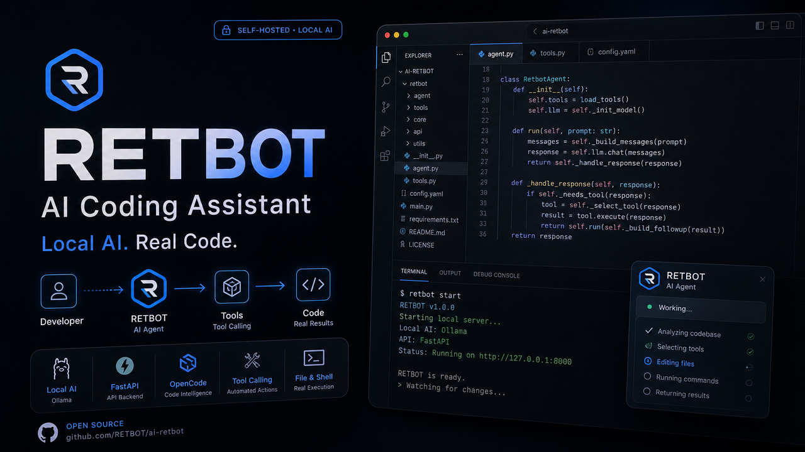

# 🤖 RETBOT - AI Coding Assistant API

> API multi-usuario con autenticación JWT y API Keys, Ollama para inferencia local, y soporte completo de **Tools/Function Calling** para OpenCode

[](https://www.python.org/downloads/)
[](https://fastapi.tiangolo.com/)
[](https://opensource.org/licenses/MIT)
[](https://github.com/RETBOT/ai-retbot/actions/workflows/ci.yml)
[](https://github.com/RETBOT/ai-retbot/releases)
[]()
[]()

> 🦜 Desarrollado y mantenido con **Quetzal**, el agente de arquitectura de software
> para este proyecto → [github.com/RETBOT/quetzal](https://github.com/RETBOT/quetzal)

<p align="center">
  
</p>

---

## 🚀 Instalación Rápida

Instalación local (Windows / Linux / Mac) con Python + Ollama.
¿Prefieres Docker? El repo incluye `docker-compose.yml` (desarrollo) y
`docker-compose.gpu.yml` (producción con GPU) — ver [🐳 Docker con GPU](#-docker-con-gpu).

### Requisitos Previos

- **Python 3.10+**
- **Ollama** instalado y corriendo ([ollama.com](https://ollama.com))
- 4GB RAM mínimo (8GB recomendado)
- 2 CPUs mínimo (4+ recomendado)
- 10GB disco libre (para el modelo)

### 1. Clonar o descargar

```bash
git clone https://github.com/RETBOT/ai-retbot.git
cd ai-retbot
```

### 2. Crear entorno virtual

```bash
# Windows
python -m venv venv
venv\Scripts\activate

# Linux/Mac
python3 -m venv venv
source venv/bin/activate
```

### 3. Instalar dependencias

```bash
pip install -r requirements.txt
```

### 4. Configurar variables de entorno

Crear archivo `.env` en la raíz:

```env
# ============================================
# CONFIGURACIÓN OBLIGATORIA
# ============================================

# Password del usuario admin (se crea automáticamente al iniciar)
ADMIN_PASSWORD=TuPasswordSuperSegura123!

# Clave secreta para JWT (cambiar en producción)
SECRET_KEY=tu_clave_secreta_larga_y_aleatoria_minimo_32_caracteres

# ============================================
# CONFIGURACIÓN OPCIONAL
# ============================================

# Modelo a usar (default: llama3.1:8b). Recomendado para programación:
MODEL_NAME=qwen2.5-coder:3b

# Puerto del servidor (default: 8000)
PORT=8000

# URL de Ollama (default: http://localhost:11434)
OLLAMA_URL=http://localhost:11434

# Rate limiting - requests por minuto (default: 10)
RATE_LIMIT_PER_MINUTE=10

# CORS - Orígenes permitidos (separados por coma)
# Para desarrollo local, los localhost están permitidos por defecto
# En producción, agregar tu dominio: ALLOWED_ORIGINS=https://tu-dominio.com
# Para permitir todos: ALLOWED_ORIGINS=*
```

> 💡 Para generar un `SECRET_KEY` seguro:
> ```bash
> openssl rand -hex 32
> ```

### 5. Descargar modelo en Ollama

```bash
# Modelo recomendado para programación
ollama pull qwen2.5-coder:3b

# O modelo general
ollama pull llama3.1:8b
```

### 6. Iniciar la API

```bash
python server.py
```

Verás algo como:
```
INFO:     Started server process [12345]
INFO:     Waiting for application startup.
INFO:     Base de datos inicializada
INFO:     Usuario admin creado desde .env
INFO:     Application startup complete.
INFO:     Uvicorn running on http://0.0.0.0:8000
```

### 7. Verificar Instalación

```bash
curl http://localhost:8000/health
```

Deberías ver algo como:
```json
{"status":"healthy","timestamp":"2026-04-27T...","service":"retbot"}
```

✅ **Listo!** La API está corriendo en `http://localhost:8000`. Sigue con
**[🔐 Primer Acceso](#-primer-acceso)** para crear tu primer API Key.

---

## 🔐 Primer Acceso

### 1. Web UI de Administración

Abre en tu navegador:
```
http://TU_IP_PUBLICA:8000/admin/ui
```

> 💡 Reemplaza `TU_IP_PUBLICA` con la IP pública o dominio de tu servidor.

**Credenciales por defecto:**
- **Usuario:** `admin`
- **Password:** El que configuraste en `ADMIN_PASSWORD`

### 2. Generar API Key

1. Inicia sesión en la Web UI
2. Ve a la pestaña **"API Keys"**
3. Click en **"Crear API Key"**
4. Ponle un nombre (ej: `OpenCode`, `Prueba`)
5. **Copia la API Key del modal** (solo se muestra una vez)
6. Guárdala en un lugar seguro

> **🔒 Almacenamiento:** las API keys se guardan **hasheadas** (HMAC-SHA256), nunca
> en texto plano. La key completa **solo se ve al crearla**; si la pierdes, revócala
> y crea una nueva.

### 3. Probar API

```bash
# Con curl
curl -X POST "http://TU_IP_PUBLICA:8000/api/v1/chat/completions" \
  -H "Content-Type: application/json" \
  -H "X-API-Key: key_TU_API_KEY_AQUI" \
  -d '{"messages": [{"role": "user", "content": "Hola"}], "stream": false, "model": "qwen2.5-coder:3b"}'
```

```powershell
# Con PowerShell
$Headers = @{
    "Content-Type"="application/json"
    "X-API-Key"="key_TU_API_KEY_AQUI"
}
$Body = '{"messages": [{"role": "user", "content": "Hola"}], "stream": false, "model": "qwen2.5-coder:3b"}'
Invoke-WebRequest -Uri "http://TU_IP_PUBLICA:8000/api/v1/chat/completions" -Method POST -Headers $Headers -Body $Body
```

---

## 🔧 Configuración para OpenCode

### En OpenCode, configura:

| Campo | Valor |
|-------|-------|
| **ID Proveedor** | `retbot` |
| **Nombre a mostrar** | `RETBOT AI` |
| **URL Base** | `http://TU_IP_PUBLICA:8000/api/v1` |
| **Clave API** | `key_TU_API_KEY_AQUI` |
| **ID Modelo** | `qwen2.5-coder:3b` |
| **Nombre del modelo** | `Qwen2.5 Coder 3B` |

### O usa el endpoint de configuración automática:

```bash
curl http://TU_IP_PUBLICA:8000/admin/opencode-config
```

Esto te devuelve un JSON que puedes copiar a tu configuración de OpenCode.

### 🛠️ Integración MCP (Tools del agente)

RETBOT incluye un **MCP Server** que expone sus capacidades (file operations,
sistema, modelos, cache, usuarios y API keys) como herramientas que el agente
descubre y usa automáticamente.

**Genera la configuración automáticamente** (detecta tu OS, tu venv y tu URL):

```bash
python scripts/setup_opencode.py --api-key key_TU_API_KEY
```

Esto crea `opencode.json` con el provider `retbot` y el MCP server configurado.
Reinicia OpenCode y listo.

**O manualmente**, agrega esto a tu `opencode.json`:

```json
"mcp": {
  "retbot": {
    "type": "local",
    "command": ["python", "retbot_mcp/server.py"],
    "enabled": true,
    "environment": {
      "MCP_WORKING_DIR": ".",
      "MCP_ENABLE_ADMIN_WRITE": "false"
    }
  }
}
```

Detalles, lista de tools y ejemplos en [docs/MCP.md](docs/MCP.md).

### 🦜 Agente Quetzal (recomendado)

**Quetzal** es el agente de arquitectura que se usa para diseñar, revisar y mantener
RETBOT — piensa primero el diseño, el código al último.

- 📦 Repositorio: [github.com/RETBOT/quetzal](https://github.com/RETBOT/quetzal)
- **Modo de trabajo:** PLAN → BUILD → REVIEW (cuestiona decisiones antes de codear)
- **Memoria persistente:** recuerda decisiones y bugs entre sesiones (Engram)
- **Integración:** usa el provider `retbot` y el MCP server descritos arriba para
  operar directamente sobre el repo

Para usarlo: arranca la API, genera tu API key, y referencia este repo como agente
en tu configuración de OpenCode.

---

## 🎯 ¿Qué es RETBOT?

RETBOT es tu asistente de programación local, diseñado específicamente para integrarse con [OpenCode](https://opencode.ai):

- **🔑 API Keys Persistentes** - No más tokens que expiran cada 7 días
- **🛠️ Tools/Function Calling** - El LLM puede leer/escribir archivos y ejecutar comandos
- **🚀 Streaming en tiempo real** - Respuestas mientras se generan vía SSE
- **🔒 Multi-usuario** - Cada quien tiene sus propias API keys, jobs y auditoría
- **🏠 Local y privado** - Todo corre en tu PC/servidor, nada va a la nube
- **🤖 Compatible OpenAI** - Funciona con OpenCode, curl, y cualquier cliente OpenAI-compatible

### ¿Por qué RETBOT?

| Feature | RETBOT | APIs Cloud (OpenAI, etc.) |
|---------|--------|---------------------------|
| **Costo** | Gratis (solo electricidad) | $$$ por token |
| **Privacidad** | 100% local | Datos en servidores externos |
| **Function Calling** | ✅ 5 tools incluidas | ✅ Disponible |
| **API Keys** | ✅ Persistentes | ✅ Persistentes |
| **Offline** | ✅ Funciona sin internet | ❌ Requiere conexión |
| **Customizable** | ✅ Código abierto | ❌ Cerrado |

---

## 🏗️ Arquitectura

```
┌─────────────────────────────────────────────────────────────┐
│                    Tu Servidor / PC                         │
├─────────────────────────────────────────────────────────────┤
│                                                             │
│  ┌──────────────────┐        ┌──────────────────┐           │
│  │   FastAPI        │───────>│     Ollama       │           │
│  │   Port: 8000     │        │   Port: 11434    │           │
│  └────────┬─────────┘        └──────────────────┘           │
│           │                                                 │
│   ┌───────┴───────┐                                         │
│   │  Auth Layer   │                                         │
│   │  JWT + API    │                                         │
│   │     Keys      │                                         │
│   └───────┬───────┘                                         │
│           │                                                 │
│           v                                                 │
│  ┌─────────────────────────────────────┐                    │
│  │        SQLite Database              │                    │
│  │  ├─ users                           │                    │
│  │  ├─ api_keys (persistentes)         │                    │
│  │  ├─ jobs                            │                    │
│  │  └─ audit_logs                      │                    │
│  └──────────────┬──────────────────────┘                    │
└─────────────────┼───────────────────────────────────────────┘
                  │
     ┌────────────┼────────────┐
     │            │            │
     v            v            v
┌─────────┐ ┌─────────┐ ┌─────────┐
│OpenCode │ │  curl   │ │ Scripts │
│Desktop  │ │  CLI    │ │Python/JS│
└─────────┘ └─────────┘ └─────────┘
```

---

## 💻 Requisitos

### Hardware Recomendado

#### Sin GPU (CPU-only)

| Componente | Mínimo | Recomendado |
|-----------|--------|-------------|
| **RAM** | 16GB | 32GB |
| **Disco** | 10GB SSD | 30GB SSD |
| **CPU** | 4 cores | 8 cores |
| **Usuarios** | 1-2 | 2-3 |

> ⚠️ **Nota:** Sin GPU, la inferencia es lenta (~1-3 tokens/segundo). Solo recomendado para desarrollo y testing.

#### 1 GPU RTX 4090 (24GB VRAM)

| Componente | Configuración |
|-----------|---------------|
| **RAM** | 32GB |
| **VRAM** | 24GB |
| **Disco** | 50GB SSD |
| **CPU** | 8 cores |
| **Usuarios** | 4-7 concurrentes |
| **Modelo** | qwen2.5-coder:14b o 32b |
| **Throughput** | ~15-25 tok/s |

#### 2 GPUs RTX 4090 (48GB VRAM)

| Componente | Configuración |
|-----------|---------------|
| **RAM** | 64GB |
| **VRAM** | 48GB (24GB × 2) |
| **Disco** | 100GB SSD |
| **CPU** | 12 cores |
| **Usuarios** | 8-15 concurrentes |
| **Modelo** | qwen2.5-coder:32b |
| **Throughput** | ~30-50 tok/s |

#### 3 GPUs RTX 4090 (72GB VRAM)

| Componente | Configuración |
|-----------|---------------|
| **RAM** | 64GB+ |
| **VRAM** | 72GB (24GB × 3) |
| **Disco** | 100GB SSD |
| **CPU** | 16 cores |
| **Usuarios** | 15-30 concurrentes |
| **Modelo** | qwen2.5-coder:32b |
| **Throughput** | ~50-80 tok/s |

### Software

- **Python 3.10+**
- **Ollama** instalado ([ollama.com](https://ollama.com))
- **Git** (opcional, para clonar)

### 🎮 Modelos Recomendados

Para **Function Calling** (tools), estos modelos funcionan mejor:

#### Modelos para Programación (Recomendados)

| Modelo | Tamaño | VRAM (Q4) | Function Calling | Notas |
|--------|--------|-----------|------------------|-------|
| **qwen2.5-coder:7b** | ~5GB | 6GB | ✅ **Excelente** | Mejor balance calidad/velocidad |
| **qwen2.5-coder:14b** | ~9GB | 12GB | ✅ **Excelente** | Recomendado para 1 GPU |
| **qwen2.5-coder:32b** | ~20GB | 24GB | ✅ **Excelente** | Mejor calidad, requiere RTX 4090 |
| **qwen2.5-coder:3b** | ~2GB | 4GB | ✅ Bueno | Para CPU o GPUs pequeñas |

#### Modelos Generales

| Modelo | Tamaño | VRAM | Function Calling | Notas |
|--------|--------|------|------------------|-------|
| **llama3.1:8b** | ~4.7GB | 6GB | ✅ **Excelente** | Recomendado por defecto |
| **llama3.2** | ~2GB | 4GB | ✅ Muy bueno | Más ligero |
| **llama3.1:70b** | ~40GB | 48GB | ✅ Excelente | Mejor calidad |
| qwen2.5:7b | ~4GB | 6GB | ⚠️ Parcial | Funciona pero no ideal |
| phi3:medium | ~4GB | 6GB | ⚠️ Parcial | Limitado |

> **⚠️ Importante:** Modelos menores a 7B (como tinyllama, phi3:mini) **NO** funcionan bien con function calling. Usar únicamente para chat simple.

---

## 🎯 Configuración por Hardware

### Sin GPU (CPU-only)

```bash
# .env
MODEL_NAME=qwen2.5-coder:3b
# OLLAMA_NUM_PARALLEL=   # COMENTAR - usar default
OLLAMA_CONTEXT_LENGTH=4096
```

**Rendimiento esperado:**
- 1-2 usuarios concurrentes
- ~1-3 tokens/segundo
- Ideal para desarrollo y testing

### 1 GPU RTX 4090 (24GB VRAM)

```bash
# .env
MODEL_NAME=qwen2.5-coder:14b      # o qwen2.5-coder:32b
OLLAMA_NUM_PARALLEL=4              # 2 si usas 32b
OLLAMA_CONTEXT_LENGTH=8192
```

**Rendimiento esperado:**
- 4-7 usuarios concurrentes (14b)
- 2-4 usuarios concurrentes (32b)
- ~15-25 tokens/segundo

### 2 GPUs RTX 4090 (48GB VRAM total)

```bash
# .env
MODEL_NAME=qwen2.5-coder:32b
OLLAMA_NUM_PARALLEL=8
OLLAMA_CONTEXT_LENGTH=8192
CUDA_VISIBLE_DEVICES=0,1
```

**Rendimiento esperado:**
- 8-15 usuarios concurrentes
- ~30-50 tokens/segundo

### 3 GPUs RTX 4090 (72GB VRAM total)

```bash
# .env
MODEL_NAME=qwen2.5-coder:32b
OLLAMA_NUM_PARALLEL=12
OLLAMA_CONTEXT_LENGTH=8192
CUDA_VISIBLE_DEVICES=0,1,2
```

**Rendimiento esperado:**
- 15-30 usuarios concurrentes
- ~50-80 tokens/segundo

---

## 📊 Tabla de Compatibilidad

| Escenario | Modelo | OLLAMA_NUM_PARALLEL | Users Concurrentes | VRAM Requerida |
|-----------|--------|---------------------|-------------------|----------------|
| **CPU** | qwen2.5-coder:3b | (default) | 1-2 | 2GB RAM |
| **CPU** | qwen2.5-coder:7b | (default) | 1-2 | 5GB RAM |
| **1 GPU 4090** | qwen2.5-coder:14b | 4 | 4-7 | 9GB |
| **1 GPU 4090** | qwen2.5-coder:32b | 2 | 2-4 | 20GB |
| **2 GPUs 4090** | qwen2.5-coder:14b | 8 | 8-12 | 18GB |
| **2 GPUs 4090** | qwen2.5-coder:32b | 4 | 4-8 | 40GB |
| **3 GPUs 4090** | qwen2.5-coder:32b | 12 | 15-30 | 60GB |

> **Nota:** Los números son aproximados y dependen del contexto usado. Contextos más largos consumen más VRAM.

---

## 🔄 Alta Disponibilidad y Load Balancing

### Múltiples Instancias de Ollama

Cuando tengas 2-3 GPUs, puedes correr múltiples instancias de Ollama para mejor distribución de carga:

#### Opción 1: Una instancia con múltiples GPUs

```bash
# Una sola instancia usando todas las GPUs
CUDA_VISIBLE_DEVICES=0,1,2
OLLAMA_NUM_PARALLEL=12
ollama serve
```

**Ventajas:**
- Más simple de configurar
- Ollama maneja la distribución interna

**Desventajas:**
- Si la instancia cae, todo se cae

#### Opción 2: Múltiples instancias + Nginx

```bash
# Instancia 1 - GPU 0
CUDA_VISIBLE_DEVICES=0 ollama serve --port 11434

# Instancia 2 - GPU 1
CUDA_VISIBLE_DEVICES=1 ollama serve --port 11435

# Instancia 3 - GPU 2
CUDA_VISIBLE_DEVICES=2 ollama serve --port 11436
```

**nginx.conf:**
```nginx
upstream ollama_backends {
    least_conn;
    server localhost:11434 max_fails=3 fail_timeout=30s;
    server localhost:11435 max_fails=3 fail_timeout=30s;
    server localhost:11436 max_fails=3 fail_timeout=30s;
}

server {
    listen 11434;
    
    location / {
        proxy_pass http://ollama_backends;
        proxy_set_header Host $host;
        proxy_set_header X-Real-IP $remote_addr;
    }
}
```

**Ventajas:**
- Aislamiento completo
- Si una GPU falla, las otras siguen
- Mejor distribución de carga

**Desventajas:**
- Más complejo de configurar
- Necesitas gestionar múltiples procesos

#### Opción 3: LiteLLM Proxy

[liteLLM](https://docs.litellm.ai/docs/proxy/quick_start) puede manejar múltiples backends:

```yaml
# config.yml
model_list:
  - model_name: qwen2.5-coder
    litellm_params:
      model: ollama/qwen2.5-coder:32b
      api_base: http://localhost:11434
  - model_name: qwen2.5-coder
    litellm_params:
      model: ollama/qwen2.5-coder:32b
      api_base: http://localhost:11435
```

**Ventajas:**
- Rate limiting integrado
- Retries automáticos
- Métricas y monitoreo
- Soporta múltiples proveedores

---

## 🔧 Configuración con OpenCode

### Opción A: Generar configuración automáticamente (Recomendado)

```bash
# 1. Hacer login para obtener token temporal
curl -X POST http://localhost:8000/auth/login \
  -H "Content-Type: application/json" \
  -d '{"username":"admin","password":"TuPasswordSuperSegura123!"}'

# Response: {"access_token":"eyJ...","token_type":"bearer"}

# 2. Usar el token para generar config automáticamente
curl -X POST http://localhost:8000/admin/setup/opencode \
  -H "Authorization: Bearer eyJ..."

# Copiar la configuración del response
```

### Opción B: Configuración manual

Crear archivo `opencode.json` en tu proyecto:

```json
{
  "$schema": "https://opencode.ai/config.json",
  "model": "retbot/llama3.1:8b",
  "provider": {
    "retbot": {
      "name": "RETBOT",
      "npm": "@ai-sdk/openai-compatible",
      "options": {
        "baseURL": "http://localhost:8000/v1",
        "headers": {
          "X-API-Key": "rb_TU_API_KEY_AQUI"
        }
      },
      "models": {
        "llama3.1:8b": {
          "name": "llama3.1:8b"
        }
      }
    }
  },
  "agent": {
    "retbot": {
      "name": "RETBOT",
      "description": "Expert AI coding assistant with filesystem access",
      "mode": "primary",
      "tools": {
        "read": true,
        "write": true,
        "edit": true,
        "bash": true
      }
    }
  }
}
```

### Crear tu primera API Key

```bash
# Crear API key para OpenCode
python cli/main.py create-api-key \
  --user admin \
  --name "OpenCode Desktop"

# Output:
# ✅ API Key creada exitosamente
# 🔑 API Key: rb_aBcD123xyz...
# 📋 Para usar con OpenCode:
#    "X-API-Key": "rb_aBcD123xyz..."

# Ver todas tus API keys
python cli/main.py list-api-keys --user admin
```

> 🔑 La key completa **solo se muestra al crearla**; `list-api-keys` muestra el hash
> enmascarado y el formato de almacenamiento (`hmac`/`legacy`).

---

## 🛠️ Tools/Function Calling

RETBOT implementa **5 tools** que permiten al LLM interactuar con tu sistema de archivos de forma segura:

### Tools Disponibles

| Tool | Descripción | Cuándo usarla |
|------|-------------|---------------|
| **`read_file`** | Lee contenido de archivos de texto | Antes de editar, para entender el código |
| **`write_file`** | Crea o sobrescribe archivos | Crear nuevos archivos o reescribir completamente |
| **`edit_file`** | Edita archivos con search/replace | Cambios pequeños y precisos (preferida) |
| **`list_directory`** | Lista contenido de directorios | Explorar estructura del proyecto |
| **`execute_command`** | Ejecuta comandos shell (whitelist) | Correr tests, linters, git, etc. |

### Ejemplo de uso

Cuando usás OpenCode con RETBOT, el LLM puede hacer cosas como:

**Usuario:** "Agregá validación de email al modelo User"

**LLM (pensamiento):**
> Necesito leer el modelo User primero para entender su estructura...

**LLM (acciones):**
1. 🔧 `[Tool] read_file("models/user.py")`
2. 🔧 `[Tool] edit_file("models/user.py", old_string="...", new_string="...")`
3. 🔧 `[Tool] execute_command("pytest tests/test_user.py -v")`

**LLM (respuesta):**
> ✅ Listo! Agregué validación de email usando regex. Los tests pasan correctamente.

### Seguridad de Tools

- ✅ **Path Traversal Protection** - No se puede acceder fuera del working directory
- ✅ **Command Whitelist** - Solo comandos permitidos (ls, python, git, pytest, etc.)
- ✅ **File Size Limits** - Máximo 10MB para lectura, 1MB para output
- ✅ **Timeout** - Comandos con límite de tiempo (default 30s, max 300s)
- ✅ **Audit Logging** - Todas las operaciones quedan registradas

### Comandos permitidos (whitelist)

```python
# File operations
ls, dir, cat, type, head, tail, wc, find

# Python
python, python3, pip, pip3, pytest

# Node.js
node, npm, npx, yarn

# Git
git, git status, git log, git diff, git show

# Build tools
make, cmake, gcc, g++, clang

# Utilities
curl, wget, tar, gzip, mkdir, rm, cp, mv
```

---

## 📡 API Endpoints

### Autenticación

| Endpoint | Método | Auth | Descripción |
|----------|--------|------|-------------|
| `/auth/login` | POST | - | Login → JWT token (expira en 7 días) |
| `/auth/me` | GET | JWT | Info del usuario actual |
| `/auth/password` | PUT | JWT | Cambiar password |

### Chat & Completions

| Endpoint | Método | Auth | Descripción |
|----------|--------|------|-------------|
| `/v1/chat/completions` | POST | API Key/JWT | Chat con streaming SSE. Soporta `max_tokens` (entero >= 1, mapeado a `options.num_predict` de Ollama) |
| `/agent/chat/completions` | POST | API Key/JWT | Chat con **soporte de tools** |
| `/v1/models` | GET | - | Listar modelos disponibles desde Ollama |

> **`max_tokens`**: opcional. Si se omite, el modelo genera sin límite (comportamiento
> default). Valores inválidos (0, negativos, bool, no-numéricos) devuelven HTTP 400.

### Administración

| Endpoint | Método | Auth | Descripción |
|----------|--------|------|-------------|
| `/admin/users` | GET | Admin | Listar todos los usuarios |
| `/admin/users` | POST | Admin | Crear nuevo usuario |
| `/admin/jobs` | GET | Admin | Ver todos los jobs |
| `/admin/audit-logs` | GET | Admin | Logs de auditoría |
| `/admin/setup/opencode` | POST | JWT | Generar configuración automática |

### Sistema

| Endpoint | Método | Auth | Descripción |
|----------|--------|------|-------------|
| `/health` | GET | - | Health check con estado de Ollama |
| `/` | GET | - | Info del servidor |

---

## 💻 Uso con curl

### Crear API Key

```bash
# Login primero
TOKEN=$(curl -s -X POST http://localhost:8000/auth/login \
  -H "Content-Type: application/json" \
  -d '{"username":"admin","password":"TuPassword"}' | jq -r '.access_token')

# Listar modelos
curl http://localhost:8000/v1/models

# Chat simple
curl -X POST http://localhost:8000/v1/chat/completions \
  -H "Content-Type: application/json" \
  -H "X-API-Key: rb_TU_API_KEY" \
  -d '{
    "messages": [{"role": "user", "content": "Hola!"}],
    "stream": true
  }'

# Chat con tools
curl -X POST http://localhost:8000/agent/chat/completions \
  -H "Content-Type: application/json" \
  -H "X-API-Key: rb_TU_API_KEY" \
  -d '{
    "messages": [{"role": "user", "content": "Lee el archivo README.md"}],
    "tools": [
      {
        "type": "function",
        "function": {
          "name": "read_file",
          "description": "Read file contents",
          "parameters": {
            "type": "object",
            "properties": {
              "path": {"type": "string"}
            }
          }
        }
      }
    ]
  }'
```

---

## 🧪 Testing

```bash
# Correr todos los tests
pytest

# Con verbose
pytest -v

# Solo tests de smoke
pytest tests/test_smoke.py -v

# Tests de tools
pytest tests/test_tools.py -v

# Con coverage
pytest --cov=core --cov=api --cov-report=html
```

### Test Results

Suite unitaria (corre en el job `unit` del CI, sin Ollama):

```
tests/test_smoke.py        ✅ passed   (Health, root, models, auth)
tests/test_api_keys.py     ✅ passed   (API key auth + contratos reveal/list)
tests/test_auth_hash.py    ✅ passed   (Hash HMAC: formato, verify, upgrade legacy)
tests/test_max_tokens.py   ✅ passed   (Payload num_predict + 400 de inválidos)
tests/test_tools.py        ✅ passed   (Tools)
tests/test_mcp.py          ✅ passed   (Servidor MCP)
tests/test_integration.py  ✅ passed   (Workflows E2E)
--------------------------------------------------
TOTAL                      ✅ 88 passed
```

Los tests de integración con **Ollama real** (`test_rate_limit.py`, `test_chat_e2e.py`)
corren en el job `integration` del CI: levantan el servidor vivo + Ollama y validan el
pipeline completo (SSE, rate limit, `max_tokens`) contra `qwen2.5-coder:0.5b`.

---

## 🐳 Docker con GPU

### Docker Compose con soporte GPU

Para producción con GPUs, usa Docker Compose con soporte NVIDIA:

```yaml
# docker-compose.gpu.yml
version: '3.8'

services:
  ollama:
    image: ollama/ollama:latest
    ports:
      - "11434:11434"
    volumes:
      - ollama_data:/root/.ollama
    environment:
      - OLLAMA_NUM_PARALLEL=4
      - OLLAMA_MAX_LOADED_MODELS=2
    deploy:
      resources:
        reservations:
          devices:
            - driver: nvidia
              count: 1
              capabilities: [gpu]

  api:
    build: .
    ports:
      - "8000:8000"
    volumes:
      - ./data.db:/app/data.db
      - ./api:/app/api
      - ./core:/app/core
    environment:
      - PORT=8000
      - MODEL_NAME=qwen2.5-coder:14b
      - MODEL_TYPE=ollama
      - OLLAMA_URL=http://ollama:11434
    env_file:
      - .env
    depends_on:
      ollama:
        condition: service_healthy
    healthcheck:
      test: ["CMD", "curl", "-f", "http://localhost:8000/health"]
      interval: 30s
      timeout: 10s
      retries: 3
      start_period: 40s

volumes:
  ollama_data:
```

### Múltiples GPUs con Docker

```yaml
# docker-compose.3gpu.yml
version: '3.8'

services:
  ollama1:
    image: ollama/ollama:latest
    ports:
      - "11434:11434"
    environment:
      - CUDA_VISIBLE_DEVICES=0
    deploy:
      resources:
        reservations:
          devices:
            - driver: nvidia
              device_ids: ['0']
              capabilities: [gpu]

  ollama2:
    image: ollama/ollama:latest
    ports:
      - "11435:11434"
    environment:
      - CUDA_VISIBLE_DEVICES=1
    deploy:
      resources:
        reservations:
          devices:
            - driver: nvidia
              device_ids: ['1']
              capabilities: [gpu]

  ollama3:
    image: ollama/ollama:latest
    ports:
      - "11436:11434"
    environment:
      - CUDA_VISIBLE_DEVICES=2
    deploy:
      resources:
        reservations:
          devices:
            - driver: nvidia
              device_ids: ['2']
              capabilities: [gpu]

  nginx:
    image: nginx:alpine
    ports:
      - "11434:11434"
    volumes:
      - ./nginx.conf:/etc/nginx/nginx.conf:ro
    depends_on:
      - ollama1
      - ollama2
      - ollama3

  api:
    build: .
    ports:
      - "8000:8000"
    environment:
      - OLLAMA_URL=http://nginx:11434
    depends_on:
      - nginx

volumes:
  ollama_data:
```

### Requisitos para Docker con GPU

1. **NVIDIA Docker Toolkit** instalado
2. **Docker Desktop** con soporte WSL2 (Windows) o Docker Engine (Linux)
3. **Drivers NVIDIA** actualizados

```bash
# Verificar que Docker ve las GPUs
docker run --rm --gpus all nvidia/cuda:11.0-base nvidia-smi
```

---

## 🔄 Actualización de Modelos

### Actualización Manual

```bash
# Ver modelos instalados
ollama list

# Actualizar un modelo
ollama pull qwen2.5-coder:14b

# Actualizar todos los modelos
ollama pull --all
```

### Actualización Automática con Scripts

RETBOT incluye scripts para automatizar la actualización:

**Linux/Mac/WSL:**
```bash
# Ejecutar script bash
./scripts/update_models.sh
```

**Windows PowerShell:**
```powershell
# Ejecutar script PowerShell
.\scripts\update_models.ps1
```

**Python (Cross-platform):**
```bash
# Ejecutar script Python
python scripts/update_models.py
```

**Qué hace el script:**
- ✅ Verifica que Ollama esté instalado y corriendo
- ✅ Verifica espacio en disco disponible
- ✅ Crea backup automático antes de actualizar
- ✅ Actualiza todos los modelos configurados
- ✅ Guarda log de actualizaciones en `logs/ollama_updates.log`
- ✅ Muestra resumen al finalizar

### Programar Actualizaciones Automáticas

**Linux/Mac - Cron Job (semanal):**
```bash
# Editar crontab
crontab -e

# Agregar línea para actualizar cada domingo a las 3 AM
0 3 * * 0 cd /ruta/ai && ./scripts/update_models.sh >> logs/ollama_updates.log 2>&1
```

**Windows - Task Scheduler:**
```powershell
# Crear tarea programada (PowerShell Admin)
$action = New-ScheduledTaskAction -Execute "PowerShell.exe" `
  -Argument "-ExecutionPolicy Bypass -File `".\scripts\update_models.ps1`""

$trigger = New-ScheduledTaskTrigger -Weekly -DaysOfWeek Sunday -At 3am

Register-ScheduledTask -TaskName "RETBOT Update Models" `
  -Action $action -Trigger $trigger -Description "Actualizar modelos de Ollama semanalmente"
```

### Consideraciones Importantes

**1. Frecuencia recomendada:**
- Cada 2-4 semanas (no más seguido)
- En horarios de baja demanda (madrugada/fin de semana)

**2. Espacio en disco:**
- Cada modelo ocupa 2-20GB según tamaño
- Las actualizaciones pueden requerir espacio temporal adicional
- Scripts hacen backup automático (ocupa espacio extra)

**3. Downtime:**
- Actualizar un modelo de 20GB: 5-30 minutos según internet
- Durante la actualización, el modelo anterior sigue disponible
- No hay downtime del servidor

**4. Backup:**
- Scripts crean backup automático en `backups/`
- Se guarda lista de modelos antes de actualizar
- Útil para rollback si hay problemas

---

## 🐛 Troubleshooting

### "Ollama not connected"

```bash
# Verificar que Ollama esté corriendo
ollama serve

# En otra terminal, verificar modelos
ollama list

# Si no hay modelos, descargar
ollama pull llama3.1:8b
```

### "API Key inválida" o 401/403

```bash
# Verificar tus API keys
python cli/main.py list-api-keys --user admin

# Crear nueva si es necesario
python cli/main.py create-api-key --user admin --name "Nueva Key"

# Verificar que estés usando el header correcto:
# X-API-Key: rb_tu_key_aqui
```

> 💡 ¿Tu key es de antes del hashing (formato `legacy`)? No pasa nada: se migra sola
> a hash en el primer uso. Para ver el formato actual:
> `python scripts/list_api_keys.py`

### "Modelo no soporta tools"

Si el LLM no está usando tools correctamente:

1. **Verificar modelo:** Asegurate de usar `llama3.1:8b` o superior
2. **Verificar endpoint:** Usar `/agent/chat/completions` (no el streaming)
3. **Verificar tools:** Enviar parámetro `tools` en el request
4. **Modelos pequeños:** tinyllama, phi3:mini NO funcionan con function calling

### Error de SQLite / Database locked

```bash
# Si hay problemas con la DB, borrar el archivo (se recrea automáticamente)
rm data.db

# O en Windows
del data.db
```

### Puerto 8000 ocupado

```bash
# Cambiar el puerto en .env
PORT=8001

# O matar proceso usando el puerto
# Windows
netstat -ano | findstr :8000
taskkill /PID <PID> /F

# Linux/Mac
lsof -ti:8000 | xargs kill -9
```

---

## 📁 Estructura del Proyecto

```
ai/
├── api/                    # Routers de FastAPI
│   ├── __init__.py
│   ├── admin.py           # Endpoints admin + API keys + setup/opencode
│   ├── auth.py            # Login, JWT
│   ├── jobs.py            # Chat completions con tools (soporta max_tokens)
│   └── streaming.py       # Streaming SSE + /v1/models (soporta max_tokens)
├── cli/                    # CLI de administración
│   ├── __init__.py
│   └── main.py            # Comandos: create-api-key, list-api-keys, etc.
├── core/                   # Core business logic
│   ├── __init__.py
│   ├── auth.py            # JWT + API Key validation (hash HMAC + upgrade legacy)
│   ├── config.py          # Settings (Pydantic)
│   ├── database.py        # SQLAlchemy models
│   ├── models.py          # Ollama provider + build_ollama_payload + max_tokens
│   └── tools/             # Tools/Function Calling
│       ├── __init__.py
│       ├── definitions.py # Schemas de tools
│       └── executor.py    # ToolExecutor seguro
├── retbot_mcp/             # MCP Server (tools del agente)
│   └── server.py          # APIConnector + tools expuestas (apikey.create, etc.)
├── scripts/                # Scripts de mantenimiento
│   ├── list_api_keys.py   # Lista keys enmascaradas + formato de almacenamiento
│   ├── update_models.sh   # Actualización (Linux/Mac/WSL)
│   ├── update_models.ps1  # Actualización (Windows)
│   └── update_models.py   # Actualización (Cross-platform)
├── tests/                  # Tests con pytest
│   ├── __init__.py
│   ├── conftest.py        # Fixtures (client ASGI, db, usuarios)
│   ├── test_smoke.py      # Tests básicos
│   ├── test_api_keys.py   # Tests de API keys + contratos reveal/list
│   ├── test_auth_hash.py  # Tests del hash HMAC / upgrade legacy
│   ├── test_max_tokens.py # Tests del parámetro max_tokens
│   ├── test_tools.py      # Tests de tools
│   ├── test_mcp.py        # Tests del servidor MCP
│   ├── test_integration.py # Tests E2E
│   ├── test_rate_limit.py # Rate limiting (server vivo, job integration)
│   └── test_chat_e2e.py   # Chat E2E real con Ollama (job integration)
├── web/                    # Web UI de administración
│   └── index.html         # Login, API keys, chat
├── .github/workflows/     # CI (ubuntu-latest: jobs unit + integration)
│   └── ci.yml
├── backups/                # Backups automáticos (gitignore)
├── logs/                   # Logs del sistema (gitignore)
├── server.py              # Entry point FastAPI
├── requirements.txt       # Dependencias
├── .env                   # Variables de entorno (gitignore)
├── .env.example           # Ejemplo de .env
├── docker-compose.yml     # Docker para desarrollo
├── docker-compose.gpu.yml # Docker para producción con GPU
├── nginx.conf.example     # Load balancing config
├── Readme.md              # Este archivo
├── GPU_SETUP_GUIDE.md     # Guía de configuración de GPUs
├── CONFIGURACION_RAPIDA.md # Referencia rápida
└── MAINTENANCE.md         # Guía de mantenimiento
```

---

## 🔒 Seguridad

### Mejores prácticas para producción

1. **Cambiar SECRET_KEY** - Usar valor aleatorio largo (32+ chars)
2. **ADMIN_PASSWORD fuerte** - Mínimo 12 caracteres, mixto
3. **HTTPS** - Usar reverse proxy (nginx, traefik) con SSL
4. **Rate limiting** - Ajustar `RATE_LIMIT_PER_MINUTE` según necesidad
5. **Firewall** - Solo exponer puerto necesario
6. **Backups** - Respaldar `data.db` regularmente
7. **SECRET_KEY estable** - Sus cambios invalidan los JWTs **y los hashes de API keys**

### API Keys: almacenamiento con hash (HMAC-SHA256)

Las API keys **nunca se guardan en texto plano** desde la v2:

- Al crearse se almacenan como **HMAC-SHA256** firmado con `SECRET_KEY`
  (formato `hmac:` + hex, visible al listarlas)
- El valor completo solo se muestra **una vez**, al momento de crear la key
- `GET /admin/api-keys/{id}/reveal` devuelve `key: null` + mensaje si la key está
  hasheada (solo las legacy devuelven el valor real)
- **Upgrade automático:** una key creada antes de esta versión (formato `legacy`)
  se migra a hash en **su primer uso** — no tienes que hacer nada
- Los listados (`web UI`, `/admin/api-keys`, CLI, MCP) siempre muestran el hash
  **enmascarado**, nunca el valor completo

> ⚠️ **SECRET_KEY es doblemente crítica**: además de firmar los JWTs, protege los
> hashes de las API keys. Usa un valor aleatorio largo (32+ chars) y **mantenlo
> estable** entre reinicios — si cambias `SECRET_KEY`, las keys hasheadas dejan de
> ser válidas (las legacy siguen funcionando y se re-hashean en el primer uso).

### Variables sensibles

NUNCA commitear el archivo `.env`. Está en `.gitignore` por defecto.

```bash
# .gitignore ya incluye:
.env
.venv/
data.db
__pycache__/
```

---

## 🚀 Roadmap / Futuras mejoras

- [x] **Soporte multi-GPU** - Configuración para 1-3 GPUs RTX 4090
- [x] **Docker Compose con GPU** - docker-compose.gpu.yml listo para producción
- [x] **Load Balancing** - Nginx config para múltiples instancias de Ollama
- [x] **Documentación GPU** - Guía detallada de configuración
- [x] **API Keys con hash** - Almacenamiento HMAC-SHA256 + upgrade automático de legacy
- [x] **max_tokens en chat** - Límite de generación por request (no-stream y streaming)
- [ ] **Streaming con Tools** - Implementar SSE interrumpido por tool execution
- [ ] **Más Tools** - Git operations, búsqueda de código, análisis estático
- [ ] **Web UI** - Interfaz web para administración
- [ ] **Múltiples modelos** - Switch dinámico entre modelos
- [ ] **Conversations** - Persistencia de threads/conversaciones
- [ ] **Plugins** - Sistema de plugins para tools custom
- [ ] **Metrics** - Prometheus/Grafana para monitoreo
- [ ] **Redis Cache** - Cache de respuestas para reducir llamadas al LLM

---

## 🤝 Contribuir

¡Las contribuciones son bienvenidas!

1. Fork el repositorio
2. Crear branch (`git checkout -b feature/nueva-feature`)
3. Commit cambios (`git commit -am 'Agregar feature'`)
4. Push al branch (`git push origin feature/nueva-feature`)
5. Crear Pull Request

### Guías de contribución

- Seguir PEP 8 para código Python
- Agregar tests para nuevas features
- Actualizar README.md si es necesario
- Respetar las convenciones existentes

---

## 📄 Licencia

Este proyecto está licenciado bajo MIT License - ver el archivo [LICENSE](LICENSE) para detalles.

---

## 🛠️ Comandos Útiles

### Ver Estado de Servicios

```bash
# Ver contenedores corriendo
docker-compose -f docker-compose.gpu.yml ps

# Ver logs en tiempo real
docker-compose -f docker-compose.gpu.yml logs -f

# Ver logs solo de API
docker-compose -f docker-compose.gpu.yml logs -f api

# Ver logs solo de Ollama
docker-compose -f docker-compose.gpu.yml logs -f ollama

# Ver uso de recursos
docker stats
```

### Reiniciar Servicios

```bash
# Reiniciar todos los servicios
docker-compose -f docker-compose.gpu.yml restart

# Reiniciar solo API
docker-compose -f docker-compose.gpu.yml restart api

# Reiniciar solo Ollama
docker-compose -f docker-compose.gpu.yml restart ollama
```

### Actualizar RETBOT

```bash
# Ir al directorio del proyecto
cd <TU_DIR_DEL_PROYECTO>

# Bajar últimos cambios
git pull origin main

# Reiniciar servicios con nuevos cambios
docker-compose -f docker-compose.gpu.yml down
docker-compose -f docker-compose.gpu.yml up -d

# Ver logs para confirmar que inició bien
docker-compose -f docker-compose.gpu.yml logs -f api
```

### Ver API Keys en Base de Datos

```bash
# Usar script incluido (mostrará hashes enmascarados + formato)
docker-compose -f docker-compose.gpu.yml exec api python /app/scripts/list_api_keys.py
```

### Gestionar Modelos de Ollama

```bash
# Ver modelos instalados
docker-compose -f docker-compose.gpu.yml exec ollama ollama list

# Descargar nuevo modelo
docker-compose -f docker-compose.gpu.yml exec ollama ollama pull qwen2.5-coder:7b

# Eliminar modelo
docker-compose -f docker-compose.gpu.yml exec ollama ollama rm qwen2.5-coder:3b

# Ver uso de VRAM/RAM
docker-compose -f docker-compose.gpu.yml exec ollama ollama ps
```

### Health Checks

```bash
# Health check simple
curl http://localhost:8000/health

# Health check completo (muestra todos los servicios)
curl http://localhost:8000/health/full

# Desde otra máquina
curl http://TU_IP_PUBLICA:8000/health
```

### Backup de Datos

```bash
# Backup de base de datos SQLite (data.db en la raíz del proyecto)
cp data.db data.db.backup.$(date +%Y%m%d)

# Backup de modelos de Ollama (solo si usas volúmenes locales)
tar -czf ollama_backup_$(date +%Y%m%d).tar.gz <TU_DIR_MODELOS_OLLAMA>/

# Backup de logs
tar -czf logs_backup_$(date +%Y%m%d).tar.gz logs/
```

### Limpieza

```bash
# Limpiar contenedores detenidos
docker container prune -f

# Limpiar imágenes no usadas
docker image prune -f

# Limpiar todo (cuidado!)
docker system prune -a -f
```

---

## 🐛 Troubleshooting

### Error: "Not authenticated"

**Causa:** La API Key no es válida o no está en la base de datos.

**Solución:**
1. Verifica que la API Key empieza con `key_`
2. Asegúrate de haber copiado la key completa del modal
3. Verifica que la key está activa en la Web UI
4. Si la perdiste, crea una nueva API Key

```bash
# Ver API Keys en BD
docker-compose -f docker-compose.gpu.yml exec api python /app/scripts/list_api_keys.py
```

### Error: "Ollama no está disponible"

**Causa:** Ollama no está corriendo o no es accesible.

**Solución:**
```bash
# Verificar si Ollama está corriendo
docker-compose -f docker-compose.gpu.yml ps ollama

# Ver logs de Ollama
docker-compose -f docker-compose.gpu.yml logs ollama

# Reiniciar Ollama
docker-compose -f docker-compose.gpu.yml restart ollama

# Verificar conexión desde API
docker-compose -f docker-compose.gpu.yml exec api curl http://ollama:11434/api/tags
```

### Error: "Address already in use"

**Causa:** El puerto 8000 o 11434 ya está en uso.

**Solución:**
```bash
# Ver qué está usando el puerto
netstat -tlnp | grep 8000
netstat -tlnp | grep 11434

# Detener proceso conflictivo
kill -9 <PID>

# O cambiar puerto en docker-compose.yml
```

### Error: "ModuleNotFoundError: No module named 'core'"

**Causa:** El código no se actualizó después de git pull.

**Solución:**
```bash
# Asegurar que estás en el directorio correcto
cd <TU_DIR_DEL_PROYECTO>

# Verificar que el código se actualizó
git log -1 --oneline

# Reiniciar contenedores
docker-compose -f docker-compose.gpu.yml down
docker-compose -f docker-compose.gpu.yml up -d
```

### Ollama usa CPU en lugar de GPU

**Causa:** No se detectó GPU NVIDIA o falta configuración.

**Solución:**
```bash
# Verificar si hay GPU
nvidia-smi

# Verificar NVIDIA Container Toolkit
docker run --rm --gpus all nvidia/cuda:11.0.3-base-ubuntu20.04 nvidia-smi

# Si no hay GPU, Ollama usará CPU automáticamente (más lento)
```

### Slow Response / Timeouts

**Causa:** Modelo muy grande para el hardware disponible.

**Solución:**
1. Usar modelo más pequeño (ej: `qwen2.5-coder:3b`)
2. Reducir `OLLAMA_CONTEXT_LENGTH` en `.env`
3. Agregar más RAM o GPU

---

## 📚 Documentación Adicional

- **[🔧 Mantenimiento](MAINTENANCE.md)** - Guía completa de mantenimiento, actualizaciones y operaciones
- **[🎮 Guía de Configuración de GPUs](GPU_SETUP_GUIDE.md)** - Instrucciones detalladas para configurar con 1-3 GPUs RTX 4090
- **[⚡ Configuración Rápida](CONFIGURACION_RAPIDA.md)** - Referencia rápida de configuraciones
- **[🐳 Docker con GPU](#-docker-con-gpu)** - Configuración Docker para producción
- **[🔄 Load Balancing](#-alta-disponibilidad-y-load-balancing)** - Múltiples instancias de Ollama

---

## 🔗 Links útiles

- [OpenCode](https://opencode.ai) - AI Coding Assistant que funciona con RETBOT
- [Ollama](https://ollama.com) - Run LLMs locally
- [Llama 3.1](https://ai.meta.com/blog/meta-llama-3-1/) - Modelo recomendado
- [FastAPI](https://fastapi.tiangolo.com/) - Framework web usado
- [SQLAlchemy](https://www.sqlalchemy.org/) - ORM para base de datos

---

## 💬 Soporte

¿Problemas? ¿Preguntas?

1. Revisar la sección [🐛 Troubleshooting](#-troubleshooting)
2. Buscar en [Issues](../../issues)
3. Crear un nuevo issue con:
   - Descripción del problema
   - Logs de error
   - Pasos para reproducir
   - Versión de Python y sistema operativo

---

<p align="center">
  <b>RETBOT</b> - Tu asistente de código local con superpoderes 🚀
  <br>
  <sub>Hecho con ❤️ para la comunidad de desarrolladores</sub>
</p>
